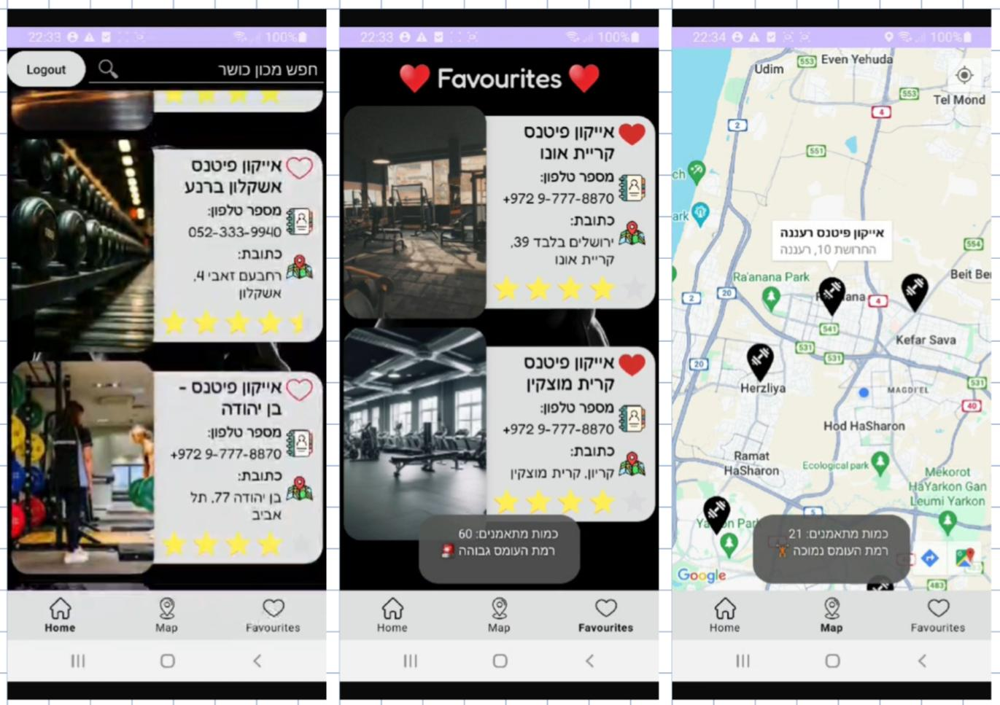
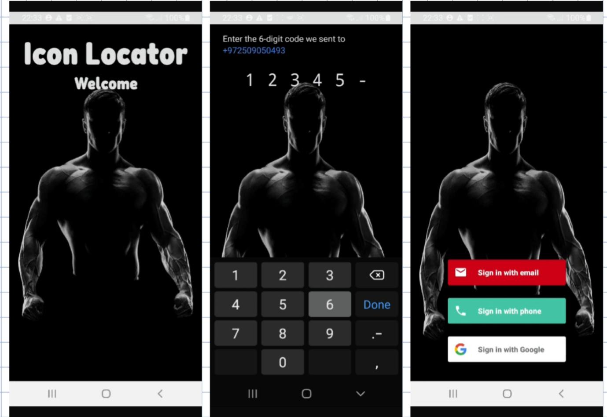

<div align="center">

# 🏋️ Icon Fitness - Gym Locator App

An Android application for the **Icon Fitness** gym chain in Israel, letting users browse 35+ branches, view real-time occupancy, manage favorites, and locate gyms on an interactive map.

Built with Firebase Authentication, Google Maps, Lottie animations, Glide image loading, and Material Design components.

Course project for **Android Development** at Afeka College of Engineering.

[🇮🇱 לקריאה בעברית](README_HE.md)

</div>

---

## 📱 App Preview

<p align="center">
  <strong>Browsing branches, real-time occupancy, phone dialer, favorites, quick map navigation, locating nearby branches, and checking availability:</strong><br><br>
  
</p>

<p align="center">
  <strong>Login screen, mobile verification, and various authentication options:</strong><br><br>
  
</p>

### Full Demo Video

[🎬 Click here to watch the full demo video](icon_app.mp4)

> Clicking the link will open GitHub's builtin video player or download the file.

---

## 📌 Problem & Solution

I built this app as my final project for the Android development course out of a real need—solving the gym crowding problem in Israel. We all know the frustration of arriving at the gym only to find no available treadmills or waiting half an time for weights.

This app provides an accessible and smart solution: through the app, any user (logged in via Firebase Auth) can view the exact number of active exercisers in real-time across all 35+ Icon Fitness branches nationwide. This allows users to easily plan their workouts, know in advance which branch is best to visit, and save valuable time.

Beyond solving the crowding problem, the project gave me hands-on experience with complex system engineering: working with external APIs (Firebase, Google Maps), building responsive UIs with RecyclerView and Material Design, securely managing shared data across screens, and handling system permissions.

### App Flow:

```
Lottie Splash Screen → Firebase Login (Email / Phone / Google) → Main App (3 Tabs)
```

---

## 🧩 Features

| Feature | Description |
|---------|-------------|
| **Splash Screen** | Animated intro using Lottie - plays once on launch |
| **Firebase Login** | Email, phone number, or Google sign-in via Firebase Auth UI |
| **Gym List (Home)** | Scrollable RecyclerView showing all 35+ branches with poster, name, address, rating, phone |
| **Search** | Real-time text filter - type to search gyms by name |
| **Favorites** | Tap the heart icon to save gyms locally (SharedPreferences + Gson) |
| **Google Maps** | Interactive map with custom markers for every branch |
| **Live Occupancy** | Current exerciser count updates every 10 seconds, with load level indicator |
| **Click-to-Call** | Tap the phone icon to call any gym directly |
| **Logout** | Sign out and return to the login screen |

---

## 🛠️ Tech Stack & Libraries

| Technology | Usage |
|------------|-------|
| **Java** | Primary language |
| **Firebase Auth** | User authentication (email, phone, Google) |
| **Firebase Auth UI** | Pre-built login screens with theming |
| **Google Maps SDK** | Map display with custom markers and location |
| **Google Location Services** | Current user location |
| **Lottie** | Animated splash screen |
| **Glide** | Image loading from URLs with placeholders |
| **Gson** | JSON serialization for SharedPreferences storage |
| **Material Design** | UI components (BottomNavigationView, ShapeableImageView, RatingBar) |
| **RecyclerView** | Efficient scrollable list with ViewHolder pattern |
| **SharedPreferences** | Local persistence for favorite gyms |

---

## 🏗️ Architecture

```
com.example.iconapplication/
│
├── MainActivity.java               # Bottom navigation controller (Home/Favorites/Map)
├── LoginActivity.java              # Firebase Auth - checks existing session
├── LottieSplashActivity.java       # Animated splash → navigates to Login
│
├── Fragments/
│   ├── HomeActivity.java           # Gym list + search + logout
│   ├── FavoriteActivity.java       # Favorites list from SharedPreferences
│   └── MapActivity.java           # Google Maps with gym markers
│
├── Models/
│   └── GYM.java                   # Data model with Builder-style setters
│
├── Interfaces/
│   └── GYMCallback.java           # Callback interface for favorite clicks
│
└── Utilities/
    ├── App.java                   # Application class - initializes ImageLoader
    ├── DataManager.java           # Data source (35+ gyms) + favorites CRUD + live updater
    ├── GYMAdapter.java            # RecyclerView adapter with click handlers
    └── ImageLoader.java           # Singleton Glide wrapper
```

### Key Design Decisions:
- **DataManager** uses a singleton pattern - data is initialized once and reused across fragments
- **ImageLoader** wraps Glide in a singleton to avoid passing Context everywhere
- **GYM model** uses Builder-style setters (`return this`) for clean object creation
- **Favorites** are stored locally with SharedPreferences + Gson, not on the server
- **Live occupancy** simulates real-time data with a `Handler` that updates every 10 seconds

---

## 📁 Project Structure

```
IconApplication2/
├── app/
│   ├── src/main/
│   │   ├── java/com/example/iconapplication/
│   │   │   ├── MainActivity.java
│   │   │   ├── LoginActivity.java
│   │   │   ├── LottieSplashActivity.java
│   │   │   ├── Fragments/         # 3 main screens
│   │   │   ├── Models/            # GYM data class
│   │   │   ├── Interfaces/        # Callback interfaces
│   │   │   └── Utilities/         # DataManager, Adapter, ImageLoader
│   │   ├── res/
│   │   │   ├── layout/            # XML layouts for all screens
│   │   │   ├── drawable/          # Icons and backgrounds
│   │   │   ├── raw/               # Lottie animation JSON
│   │   │   └── values/            # Colors, strings, themes
│   │   └── AndroidManifest.xml
│   └── build.gradle.kts
├── build.gradle.kts
├── settings.gradle.kts
└── icon_app.mp4                   # Demo video
```

---

## 🚀 How to Build & Run

1. Clone the repository
2. Open in **Android Studio** (Hedgehog or newer recommended)
3. Add your own `google-services.json` from [Firebase Console](https://console.firebase.google.com/)
4. Add your Google Maps API key in `AndroidManifest.xml`
5. Sync Gradle and run on a device/emulator (API 26+)

> **Note:** The `google-services.json` file is excluded from the repo for security. You'll need to create your own Firebase project and enable Authentication (Email, Phone, Google).

---

## 👤 Author

**Golan Levi** - Afeka College of Engineering

---

## 📄 License

This project is licensed under the MIT License.
